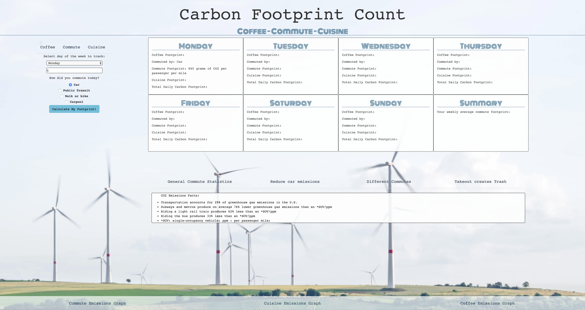

# _Carbon Footprint Calculator_

#### _A website that calculates users carbon output thru various daily tasks, November 8, 2018_

#### By _**Leo Mangutov, Kohichi Horii, Brooke Perry, Maly Phongsavanh**_

## Description

_This website first collects what type of transportation a user uses and the distance they traveled then the user enters if they had coffee this morning and finally the user enter if the user ate out for lunch per day of the week. After collecting all the data the website calculates the amount of carbon footprint they output per gram of CO2. After the data is collected the user can also see a bar graph image to show if their output has increased or decreased over the week. User can also look at different suggestions to reduce their daily carbon footprint output such as ways to lower their car emissions, different transportation types, and a video to show how much America uses single use items and ways to avoid using them._

## Setup/Installation Requirements

###[GH-Pages](https://mangutov89.github.io/carbon-footprint/)

* _Clone this repository_
* _Open folder containing Carbon-Footprint_
* _Open index.html_

_Open the webpage, then user can enter all of their data on the left, and tab over to other options and see the results on the calendar on the right_

## Known Bugs

_{Are there issues that have not yet been resolved that you want to let users know you know?  Outline any issues that would impact use of your application.  Share any workarounds that are in place. }_

## Support and contact details

_If you are having any issues or if you would like to contribute feel to contact us_
 * (Leo Mangutov)[mailto:leo.mangutov@gmail.com
 * (Brooke Perry)[mailto:perrysbrooke@gmail.com
 * (Maly Phongsavanh)[mailto:phongsavanh619@icloud.com]

## Technologies Used

_HTML_
_CSS_
_JavaScript_
_jQuery_
_Atom_

## Resources

Utensils
http://www.worldcentric.org/about-compostables/eco-profiles/plastics

Paper towels
https://twosidesna.org/US/our-carbon-footprint-how-do-paper-products-fit-in/

Bagasse
http://www.worldcentric.org/sustainability/manufacturing/bagasse

Paper cup
http://www.appropedia.org/Paper_cup

Coffee
https://drinks.seriouseats.com/2013/10/calculating-coffees-carbon-footprint-energy-usage-to-farm-pick-ship-roast-brew-coffee.htmlß

Coffee per cups output

https://www.theguardian.com/environment/green-living-blog/2010/jun/17/carbon-footprint-of-tea-coffee

### License

*This software is licensed under the MIT license*

Copyright (c) 2018 **_Leo Mangutov, Kohichi Horii, Brooke Perry, Maly Phongsavanh_**
